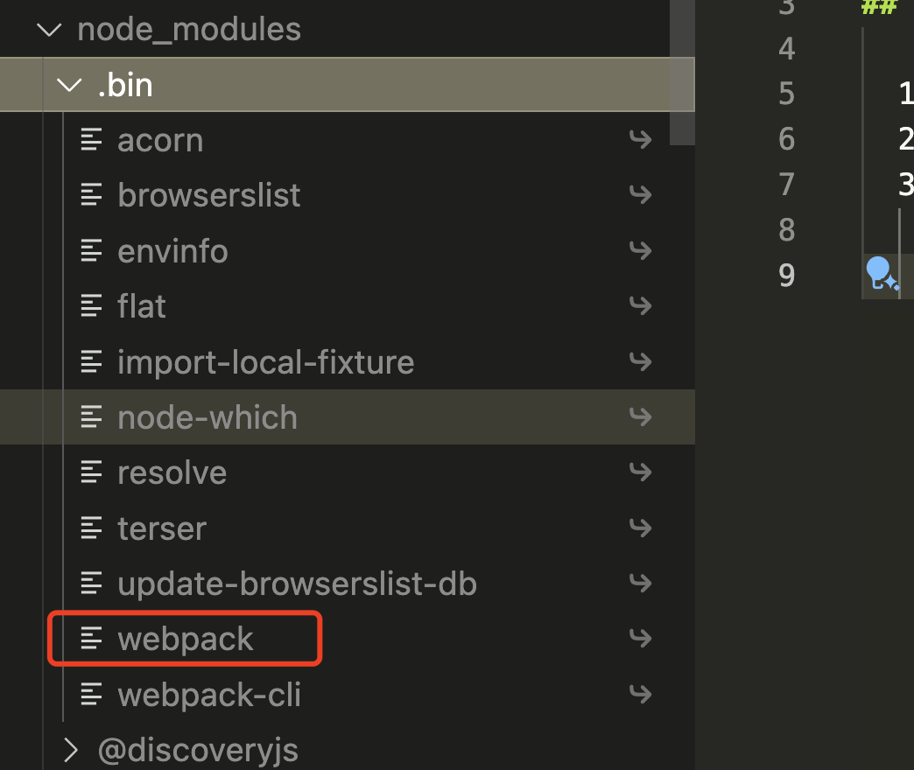

# mini-webpack

## 前置内容-搭建项目

  1.npm init -y
  2.npm install webpack webpack-cli --save
  3.修改package.json增加构建命令：
    "build": "webpack"
    他会到node_modules目录下的.bin目录找到webpack执行命令，执行构建命令；
    
  4.新建个文件，执行命令，文件
    [目录](./debug.js);
  
## 前置内容-了解一些基本概念

### tapable

  tapable是属于给插件注册事件和触发事件用的；注册在不同阶段，在不同阶段触发；
  [text](doc/1.tapable.js)

## 开始搭建

  1.在my-webpack下增加index.js，表示要加载内容
  2.写几个loader，加点log
  3.写几个plugin，加点log

### 1.解析从node命令上带的参数

  1.因为webpack-cli有些自带的参数或者--watch这种需要获取到，然后处理
  2.然后将参数配置和webpack.config.js中的配置合并传给Compiler

### 2.初始化Compiler实例&注册插件

  1.初始化Compiler主要是给Compiler对象增加处理好的配置
  2.注册插件就是执行插件的apply方法，插件会在这个方法里把需要执行操作的钩子上增加这个插件的回调方法；

### 3.执行Compiler的run方法，执行打包

  1.创建Complication实例
    就是初始化参数
  2.执行实例的build方法

### Complication的build逻辑

  1.就是使用loader处理
  2.ast语法树解析，获取需要处理的内容：
    使用require，import等需要加载的资源，放入依赖数组中，
  3.然后修改ast中依赖改为依赖id，不是路径
  4.遍历依赖数组，没有被处理的依赖，循环执行上面流程，直到所有的数据都被处理完
    中间还涉及循环依赖的问题，缓存判断下，是否已经加载了；

### chunk转换成文件输出

  就是将依赖的资源根据结构输出到文件系统

### 执行插件钩子

  1.在很多地方会执行插件钩子，这只是最后也会执行，表示一下，不是只有这一个阶段；